---
## Front matter
title: "Лабараторная работа №04. НПИбд-03-24"
subtitle: "Подготовил:"
author: "Гелдиев Ыхлас. Студенческий номер: 1032249184"

## Generic otions
lang: ru-RU
toc-title: "Содержание"

## Bibliography
bibliography: bib/cite.bib
csl: pandoc/csl/gost-r-7-0-5-2008-numeric.csl

## Pdf output format
toc: true # Table of contents
toc-depth: 2
lof: true # List of figures
lot: true # List of tables
fontsize: 12pt
linestretch: 1.5
papersize: a4
documentclass: scrreprt
## I18n polyglossia
polyglossia-lang:
  name: russian
  options:
	- spelling=modern
	- babelshorthands=true
polyglossia-otherlangs:
  name: english
## I18n babel
babel-lang: russian
babel-otherlangs: english
## Fonts
mainfont: IBM Plex Serif
romanfont: IBM Plex Serif
sansfont: IBM Plex Sans
monofont: IBM Plex Mono
mathfont: STIX Two Math
mainfontoptions: Ligatures=Common,Ligatures=TeX,Scale=0.94
romanfontoptions: Ligatures=Common,Ligatures=TeX,Scale=0.94
sansfontoptions: Ligatures=Common,Ligatures=TeX,Scale=MatchLowercase,Scale=0.94
monofontoptions: Scale=MatchLowercase,Scale=0.94,FakeStretch=0.9
mathfontoptions:
## Biblatex
biblatex: true
biblio-style: "gost-numeric"
biblatexoptions:
  - parentracker=true
  - backend=biber
  - hyperref=auto
  - language=auto
  - autolang=other*
  - citestyle=gost-numeric
## Pandoc-crossref LaTeX customization
figureTitle: "Рис."
tableTitle: "Таблица"
listingTitle: "Листинг"
lofTitle: "Список иллюстраций"
lotTitle: "Список таблиц"
lolTitle: "Листинги"
## Misc options
indent: true
header-includes:
  - \usepackage{indentfirst}
  - \usepackage{float} # keep figures where there are in the text
  - \floatplacement{figure}{H} # keep figures where there are in the text
---

# Цель работы

Освоить процедуры сборки и компиляции программ, написанных на ассемблере

# Выполнение лабораторной работы

## Программа Hello world!

1. Создал каталог lab04 и перешёл в него (рис. [-@fig:001])

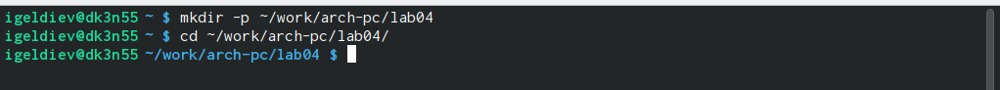{#fig:001}

2. Создал файл hello.asm (рис. [-@fig:002])

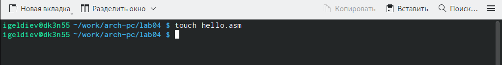{#fig:002}

3. Открыл файл и ввел текст (рис. [-@fig:003])

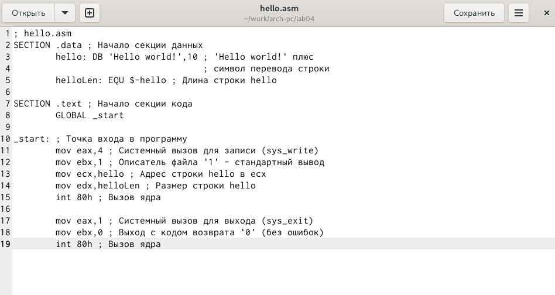{#fig:003}

## Транслятор NASM

4. Скомпилировал объект с помощью nasm и проверил что он создался (рис. [-@fig:004])

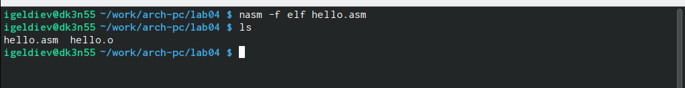{#fig:004}

5. Скомпилировал объект obj.o из hello.asm и проверил что создалось (рис. [-@fig:005])

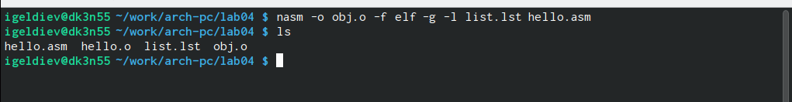{#fig:005}

## Компоновщик LD

6. Скомпановал объект hello.o и с помощью команды ls проверил что исполняемый файл был создан (рис. [-@fig:006])

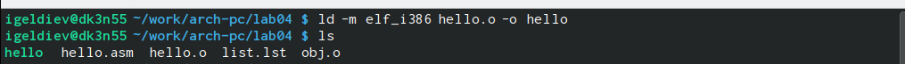{#fig:006}

7. Скомпанвал объект obj.o в файл main и проверил какое имя имеет исполняемый файл. (рис. [-@fig:007])

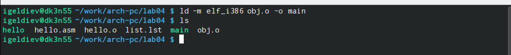{#fig:007}

## Запуск исполняемого файла

8. Запустил файл hello (рис. [-@fig:008])

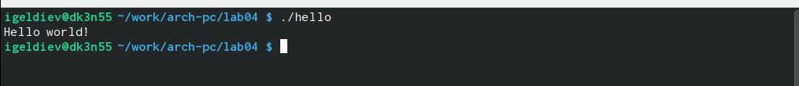{#fig:008}

# Задание для самостоятельной работы

9. Скопировал файл hello.asm в lab4.asm (рис. [-@fig:009])

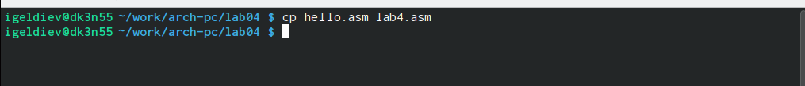{#fig:009}

10. С помощью gedit изменил lab4.asm так, что теперь он выводит мои фамилию и имя (рис. [-@fig:010])

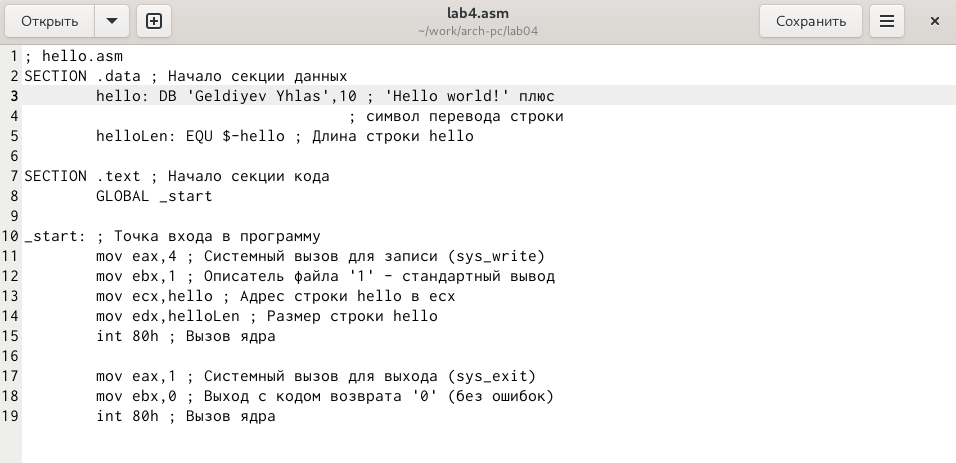{#fig:010}

11. Оттранслировал lab4.asm в объектный файл, выполнил компановку и запустил исполняемый файл (рис. [-@fig:011])

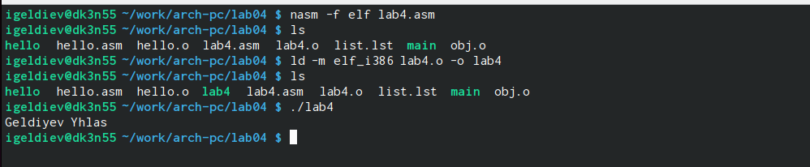{#fig:011}

12. Скопировал файлы hello.asm и lab4.asm в ~/work/study/2023-2024/"Архитектура компьютера"/arch-pc/labs/lab04/ и загрузил файлы на Github (рис. [-@fig:012]) (рис. [-@fig:013])

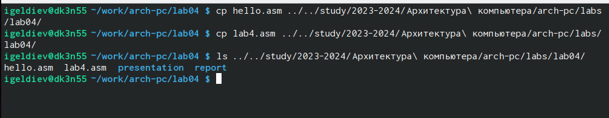{#fig:012}

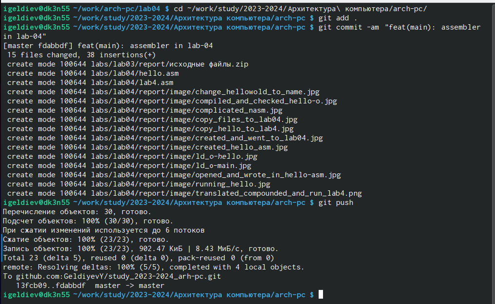{#fig:013}

# Выводы

Я освоил процедуры сборки и компиляции программ, написанных на ассемблере.

