---
## Front matter
title: "Лабараторная работа №05. НПИбд-03-24"
subtitle: "Подготовил:"
author: "Гелдиев Ыхлас. Студенческий номер: 1032249184"

## Generic otions
lang: ru-RU
toc-title: "Содержание"

## Bibliography
bibliography: bib/cite.bib
csl: pandoc/csl/gost-r-7-0-5-2008-numeric.csl

## Pdf output format
toc: true # Table of contents
toc-depth: 2
lof: true # List of figures
lot: true # List of tables
fontsize: 12pt
linestretch: 1.5
papersize: a4
documentclass: scrreprt
## I18n polyglossia
polyglossia-lang:
  name: russian
  options:
	- spelling=modern
	- babelshorthands=true
polyglossia-otherlangs:
  name: english
## I18n babel
babel-lang: russian
babel-otherlangs: english
## Fonts
mainfont: IBM Plex Serif
romanfont: IBM Plex Serif
sansfont: IBM Plex Sans
monofont: IBM Plex Mono
mathfont: STIX Two Math
mainfontoptions: Ligatures=Common,Ligatures=TeX,Scale=0.94
romanfontoptions: Ligatures=Common,Ligatures=TeX,Scale=0.94
sansfontoptions: Ligatures=Common,Ligatures=TeX,Scale=MatchLowercase,Scale=0.94
monofontoptions: Scale=MatchLowercase,Scale=0.94,FakeStretch=0.9
mathfontoptions:
## Biblatex
biblatex: true
biblio-style: "gost-numeric"
biblatexoptions:
  - parentracker=true
  - backend=biber
  - hyperref=auto
  - language=auto
  - autolang=other*
  - citestyle=gost-numeric
## Pandoc-crossref LaTeX customization
figureTitle: "Рис."
tableTitle: "Таблица"
listingTitle: "Листинг"
lofTitle: "Список иллюстраций"
lotTitle: "Список таблиц"
lolTitle: "Листинги"
## Misc options
indent: true
header-includes:
  - \usepackage{indentfirst}
  - \usepackage{float} # keep figures where there are in the text
  - \floatplacement{figure}{H} # keep figures where there are in the text
---

# Цель работы

Приобретение практических навыков работы с Midnight Commander. Изучение инструкций ассемблера, такие как mov и int.

# Выполнение лабораторной работы

1. Открыл Midnight Commander (рис. [-@fig:001])

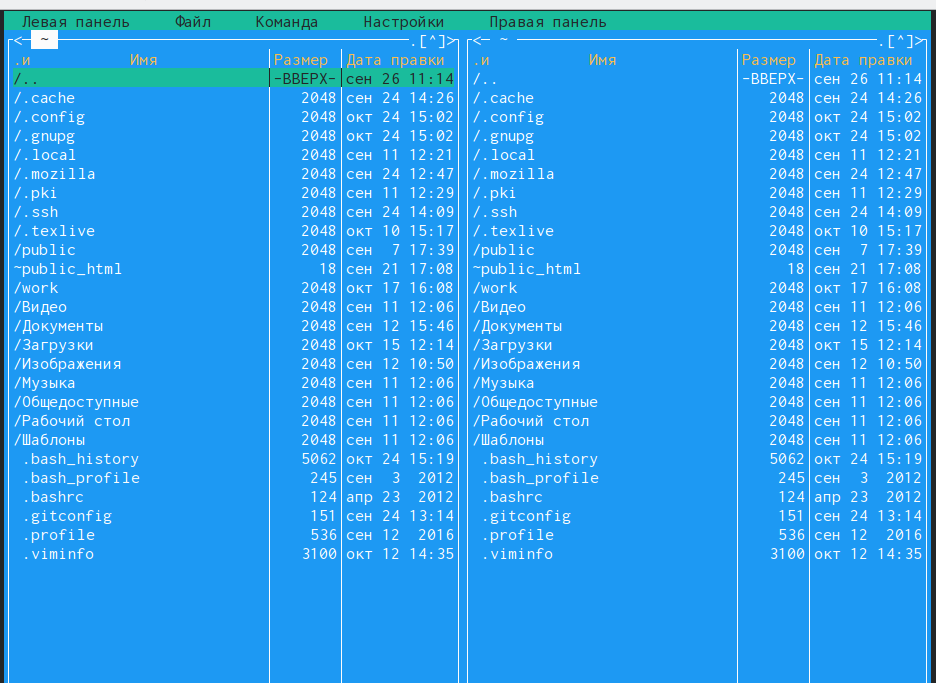{#fig:001 width=100%}

2. Перешел в каталог ~/work/arch-pc (рис. [-@fig:002])

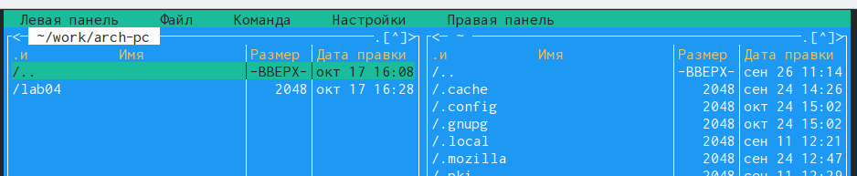{#fig:002 width=100%}

3. Создал lab05 (рис. [-@fig:003])

{#fig:003 width=100%}

4. Создал файл lab5-1.asm (рис. [-@fig:004])

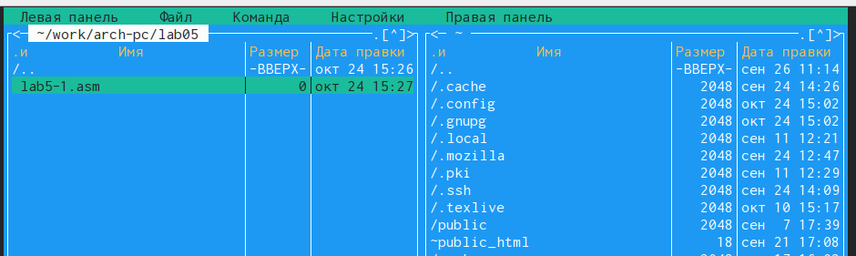{#fig:004 width=100%}

5. Открыл lab5-1.asm для редактирования (рис. [-@fig:005])

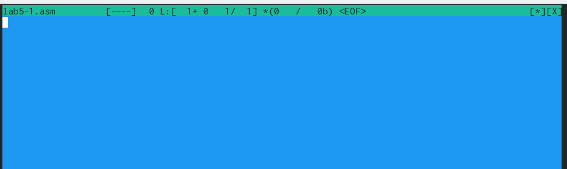{#fig:005 width=100%}

6. Ввел текст из лиситинга, сохранил изменения и закрыл файл (рис. [-@fig:006])

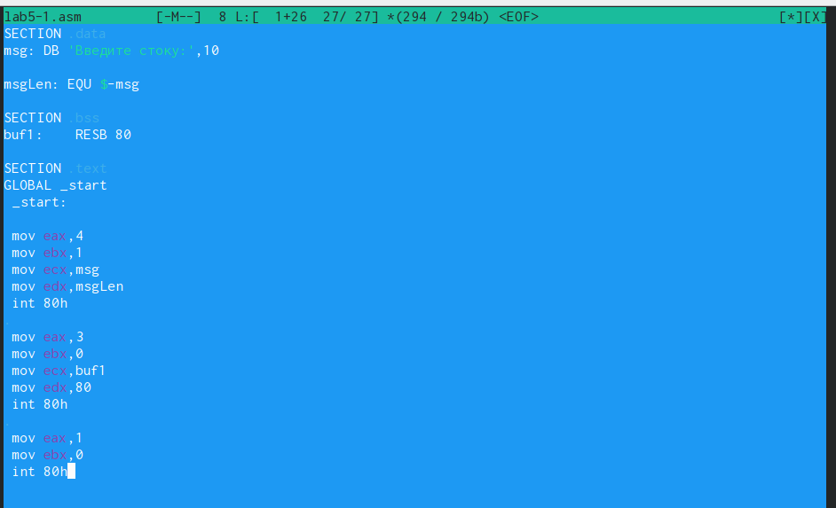{#fig:006 width=100%}

7. Убедился, что файл содержит текст программы. (рис. [-@fig:007])

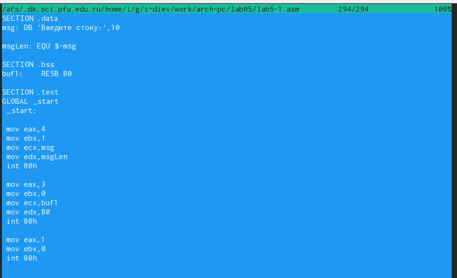{#fig:007 width=100%}

8. Оттранслировал, выполнил компановку и запустил файл (рис. [-@fig:008])

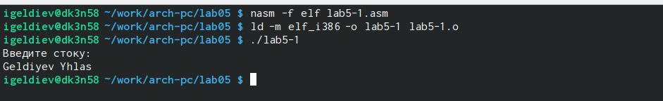{#fig:008 width=100%}

## Подключение внешнего файла in_out.asm

9. Скопировал файл in_out.asm в lab05 (рис. [-@fig:009])

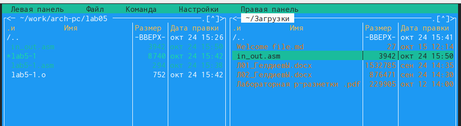{#fig:009 width=100%}

10. Создал копию файла lab5-1.asm с именем lab5-2.asm (рис. [-@fig:010])

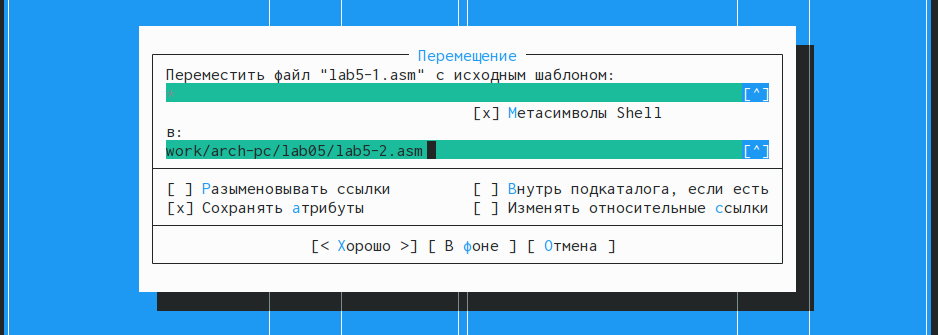{#fig:010 width=100%}

11. Исправил текст программы lab5-2.asm в соответствии с листингом с использованием подпрограмм из внешнего файла in_out.asm (рис. [-@fig:011]). Создал исполняемый файл и проверил его работу (рис. [-@fig:012]).

{#fig:011}

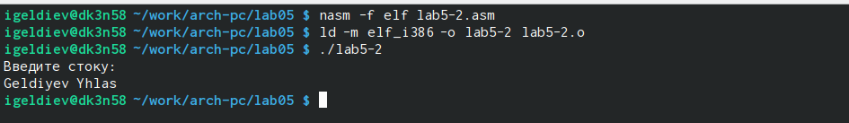{#fig:012}

12. Заменил sprintLF на sprint в lab5-2.asm (рис. [-@fig:013]). Теперь после вывода сообщения не будет перехода на новую строку.

{#fig:013}

# Самостоятельная работа

1. Создал копию lab5-1 и внес изменения для того чтобы она работала по заданному алгоритму (рис. [-@fig:014]).

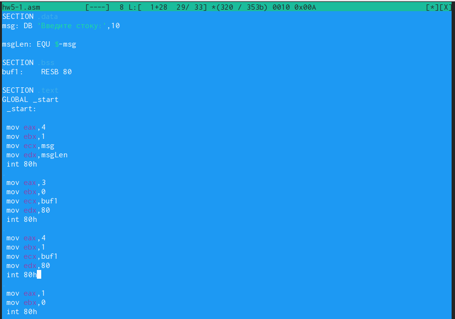{#fig:014}

2. Получил исполняемый файл и проверил его работу (рис. [-@fig:015]).

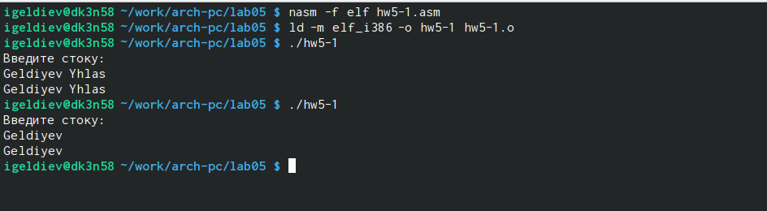{#fig:015}

3. Создал копию файла lab5-2.asm и внес изменения для того чтобы она работала по заданному алгоритму (рис. [-@fig:016])

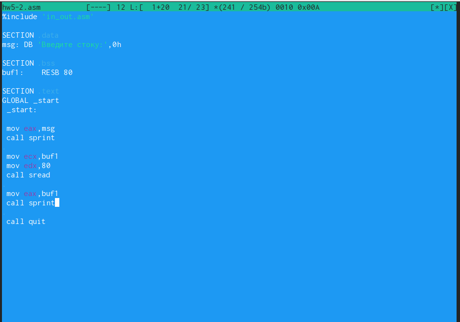{#fig:016}

4. Создал исполняемый файл и проверил его работу (рис. [-@fig:017])

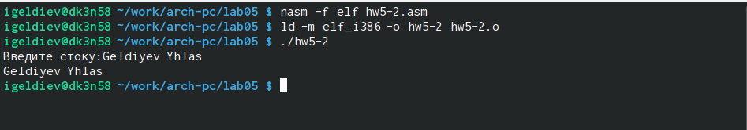{#fig:017}

# Выводы

Я уверенно владею инструментами Midnight Commander и глубоко пониманимаю инструкции языка ассемблер, таких как mov и int.

