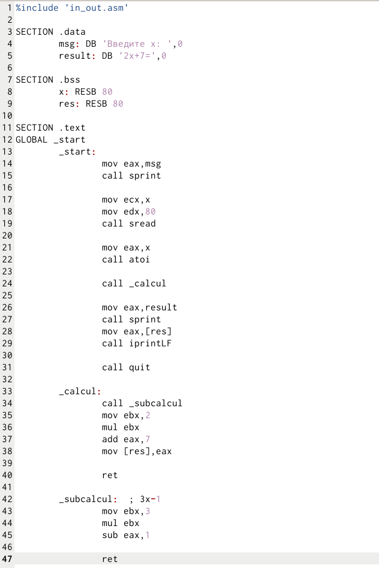
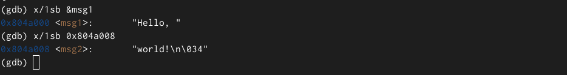

---
## Front matter
title: "Лабараторная работа №09. НПИбд-03-24"
subtitle: "Подготовил:"
author: "Гелдиев Ыхлас. Студенческий номер: 1032249184"

## Generic otions
lang: ru-RU
toc-title: "Содержание"

## Bibliography
bibliography: bib/cite.bib
csl: pandoc/csl/gost-r-7-0-5-2008-numeric.csl

## Pdf output format
toc: true # Table of contents
toc-depth: 2
lof: true # List of figures
lot: true # List of tables
fontsize: 12pt
linestretch: 1.5
papersize: a4
documentclass: scrreprt
## I18n polyglossia
polyglossia-lang:
  name: russian
  options:
	- spelling=modern
	- babelshorthands=true
polyglossia-otherlangs:
  name: english
## I18n babel
babel-lang: russian
babel-otherlangs: english
## Fonts
mainfont: IBM Plex Serif
romanfont: IBM Plex Serif
sansfont: IBM Plex Sans
monofont: IBM Plex Mono
mathfont: STIX Two Math
mainfontoptions: Ligatures=Common,Ligatures=TeX,Scale=0.94
romanfontoptions: Ligatures=Common,Ligatures=TeX,Scale=0.94
sansfontoptions: Ligatures=Common,Ligatures=TeX,Scale=MatchLowercase,Scale=0.94
monofontoptions: Scale=MatchLowercase,Scale=0.94,FakeStretch=0.9
mathfontoptions:
## Biblatex
biblatex: true
biblio-style: "gost-numeric"
biblatexoptions:
  - parentracker=true
  - backend=biber
  - hyperref=auto
  - language=auto
  - autolang=other*
  - citestyle=gost-numeric
## Pandoc-crossref LaTeX customization
figureTitle: "Рис."
tableTitle: "Таблица"
listingTitle: "Листинг"
lofTitle: "Список иллюстраций"
lotTitle: "Список таблиц"
lolTitle: "Листинги"
## Misc options
indent: true
header-includes:
  - \usepackage{indentfirst}
  - \usepackage{float} # keep figures where there are in the text
  - \floatplacement{figure}{H} # keep figures where there are in the text
---

# Цель работы

Приобретение навыков написания программ с использованием подпрограмм. Знакомство
с методами отладки при помощи GDB и его основными возможностями.

# Выполнение лабораторной работы

## Реализация подпрограмм в NASM

1. Создал каталог для программ, перешел в него и создал файл lab09-1.asm (рис. [-@fig:001])

{#fig:001}

2. Заполнил lab09-1.asm (рис. [-@fig:002])

{#fig:002}

3. Создал исполняемый файл и запустил его (рис. [-@fig:003])

{#fig:003}

4. Изменил текст программы добавив _subcalcul(рис. [-@fig:004])

{#fig:004}

5. Создал исполняемый файл и запустил его (рис. [-@fig:005])

{#fig:005}

## Отладка программам с помощью GDB

8. Создал файл lab09-2.asm (рис. [-@fig:008])

{#fig:008}

9. Заполнил lab09-2.asm (рис. [-@fig:009])

{#fig:009}

10. Получил исполняемый файл с отладочной информацией при помощи ключа -g при трансляции и загрузил исполняемый файл в отладчик. Так же проверил работу программы при помощи команды run, поставил точку остонова при помощи break и запустил его, а так же посмотрел дисассимблированный код (рис. [-@fig:010]).

{#fig:010}

11. Переключаюсь на отображение команд с Intel'овским синтаксисом. (рис. [-@fig:011])

{#fig:011}

12. Включил режим псевдографики (рис. [-@fig:012])

{#fig:012}

### Добавление точек останова

13. Проверка устоновки точки остонова и установления еще одного в конце программы (рис. [-@fig:013])

{#fig:013}

### Работа с данными программы в GDB

15. Посмотрел содержимое регистров (рис. [-@fig:014])

{#fig:014}

16. Просмотр значения переменной msg1 (рис. [-@fig:015])

{#fig:015}

17. Изменил первый символ msg1 и msg2 (рис. [-@fig:016])

{#fig:016}

18. Вывел в различных форматах edx (рис. [-@fig:017])

{#fig:017}

19. Изменение значения ebx (рис. [-@fig:018])

{#fig:018}

20. Создание lab09-3.asm и создал исполняемый файл, так же загрузил исполняемый файл в gdb c аргументами (рис. [-@fig:019])

{#fig:019}

21. Установил точку остонова в начале файла и запустил ее. Проверил все позиции стека (рис. [-@fig:020])

{#fig:020}

# Выполнение заданий для самостоятельной работы

1. Преобразовал программу самостоятельной работы №8 (рис. [-@fig:021]) (рис. [-@fig:022]).

{#fig:021}

{#fig:022}

2. Заполнение неправильной программы hw2.asm и запуск программы в gdb для нахождения ошибки. (рис. [-@fig:023]) (рис. [-@fig:024])

{#fig:023}

{#fig:024}

3. Нахождение ошибка в неправильном использовании mul и замены ebx на eax в некоторых местах и проверка программы (рис. [-@fig:025]) (рис. [-@fig:026])

{#fig:025}

{#fig:026}

# Выводы

Я научился писать программы с использованием подпрограмм. Я познакомился
с методами отладки при помощи GDB и его основными возможностями.

