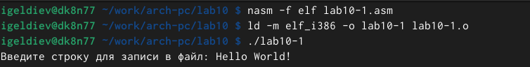

---
## Front matter
title: "Лабараторная работа №10. НПИбд-03-24"
subtitle: "Подготовил:"
author: "Гелдиев Ыхлас. Студенческий номер: 1032249184"

## Generic otions
lang: ru-RU
toc-title: "Содержание"

## Bibliography
bibliography: bib/cite.bib
csl: pandoc/csl/gost-r-7-0-5-2008-numeric.csl

## Pdf output format
toc: true # Table of contents
toc-depth: 2
lof: true # List of figures
lot: true # List of tables
fontsize: 12pt
linestretch: 1.5
papersize: a4
documentclass: scrreprt
## I18n polyglossia
polyglossia-lang:
  name: russian
  options:
	- spelling=modern
	- babelshorthands=true
polyglossia-otherlangs:
  name: english
## I18n babel
babel-lang: russian
babel-otherlangs: english
## Fonts
mainfont: IBM Plex Serif
romanfont: IBM Plex Serif
sansfont: IBM Plex Sans
monofont: IBM Plex Mono
mathfont: STIX Two Math
mainfontoptions: Ligatures=Common,Ligatures=TeX,Scale=0.94
romanfontoptions: Ligatures=Common,Ligatures=TeX,Scale=0.94
sansfontoptions: Ligatures=Common,Ligatures=TeX,Scale=MatchLowercase,Scale=0.94
monofontoptions: Scale=MatchLowercase,Scale=0.94,FakeStretch=0.9
mathfontoptions:
## Biblatex
biblatex: true
biblio-style: "gost-numeric"
biblatexoptions:
  - parentracker=true
  - backend=biber
  - hyperref=auto
  - language=auto
  - autolang=other*
  - citestyle=gost-numeric
## Pandoc-crossref LaTeX customization
figureTitle: "Рис."
tableTitle: "Таблица"
listingTitle: "Листинг"
lofTitle: "Список иллюстраций"
lotTitle: "Список таблиц"
lolTitle: "Листинги"
## Misc options
indent: true
header-includes:
  - \usepackage{indentfirst}
  - \usepackage{float} # keep figures where there are in the text
  - \floatplacement{figure}{H} # keep figures where there are in the text
---

# Цель работы

Приобретение навыков написания программ для работы с файлами.

# Выполнение лабораторной работы

1. Создал каталог lab10 и создал файлы lab10-1.asm, readme-1.txt и readme-2.txt (рис. [-@fig:001])

{#fig:001}

2. Ввел в файл lab10-1.asm текст из листинга (рис. [-@fig:002])

{#fig:002}

3. Создал исполняемый файл и проверил работу программы (рис. [-@fig:003])

{#fig:003}

4. Запретил выполнение lab10-1 и попытался его запустить (рис. [-@fig:004])

{#fig:004}

5. Разрешил выполнение lab10-1.asm и запустил его (рис. [-@fig:005])

{#fig:005}

6. Выполнение задания с правами доступа для варианта №5 (рис. [-@fig:006])

{#fig:006}

# Самостоятельная работа

1. Выполнение работы и проверка выполнения. (рис. [-@fig:007]) (рис. [-@fig:008])

{#fig:007}

{#fig:008}

# Выводы

Я приобрел навыки написания программ для работы с файлами.

